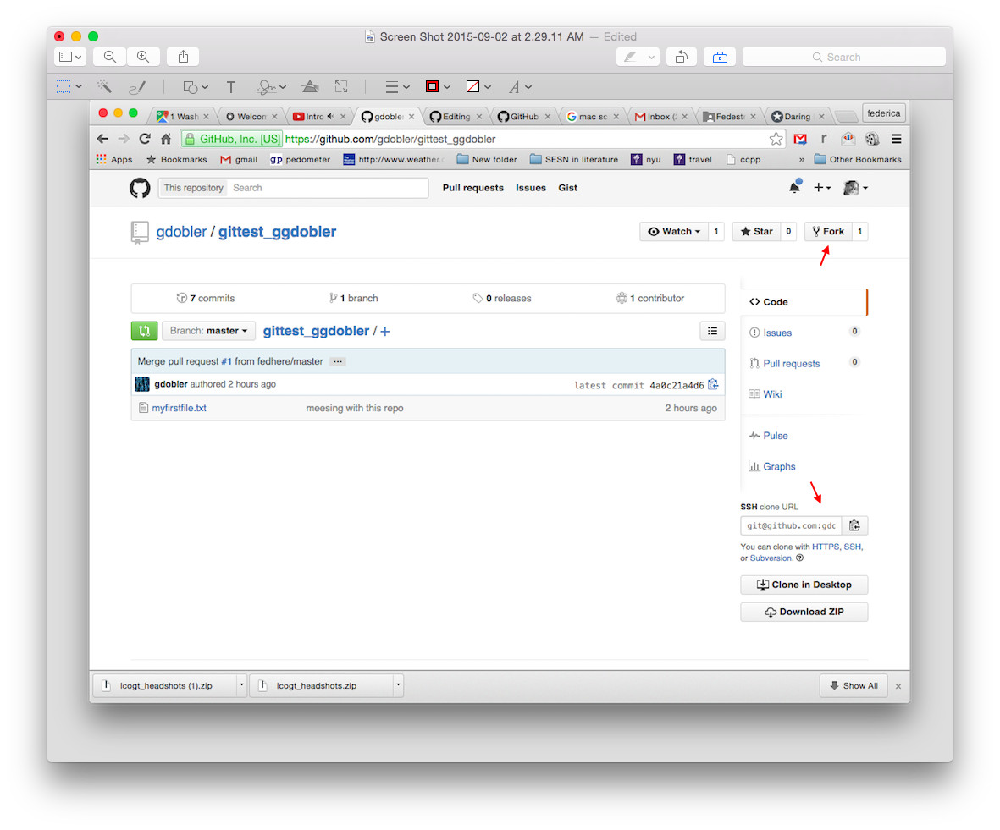
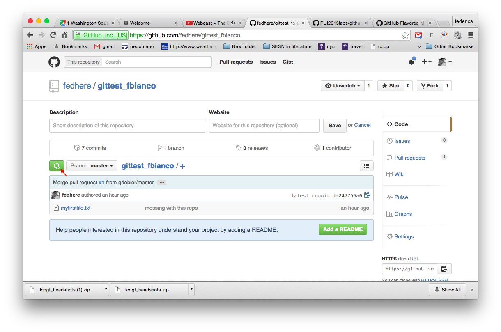
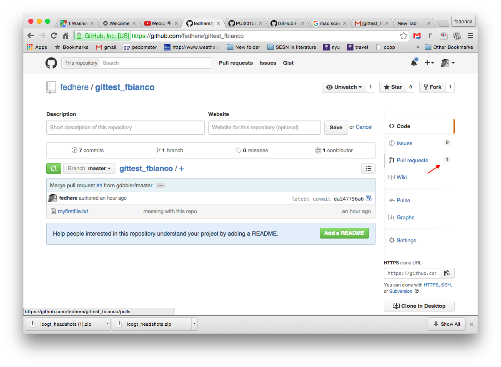
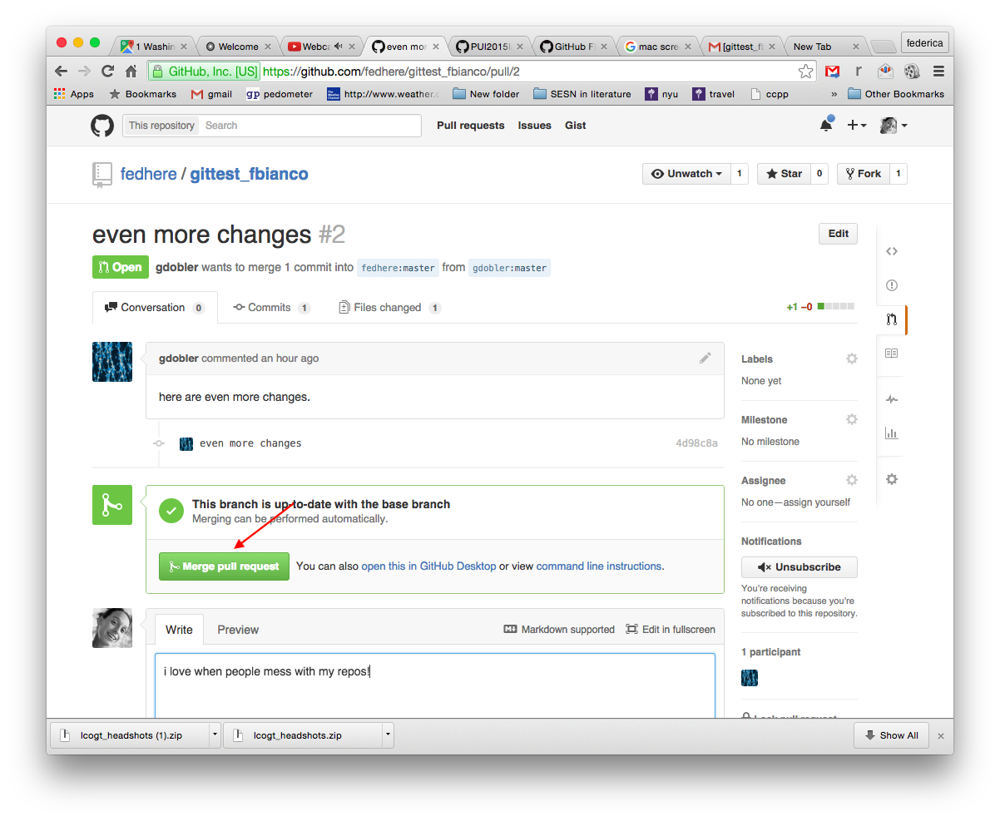

#this is a markdown file guiding you through of the very first steps to create and manage a git repo with github
##lets start on your bash shell
##crete a directory


```
mkdir gittest_fbianco
```

##get in the directory to start working

```
cd gittest_fbianco/
```

## the following command initiates a LOCAL git repository: files can be tracked on your own machine from now on.

```
git init
git status
```

##create a first file. this commands creates an empty file with the name you pass as argument

```
touch myfirstfile.txt
```

##see if it got created ok

```
ls -l
git status
```

##your git repo knows nothing about it yet: you need to add it to the repo for it to get tracked

```
git add myfirstfile.txt 
git status
```

##can we commit it to github to have it in the cloud?

```
git commit myfirstfile.txt -m 'trying to commit'
git push
```

##why did you get a message?? because you have not told this repo where in the cloud to look for its remote version

#first go online and create a repository. 


##then follow the direction (use the appropriate URL in the command below)

```
git remote add origin  https://github.com/fedhere/gittest_fbianco.git
git push -u origin master 
```

##the following command shows you what URL you push and pull from (need not be the same generally)

```
git remote -v 
git status
```

##lets make local changeds to the file...

```
echo "whatever" >> myfirstfile.txt 
git status
```

##...and commit them

```
git commit myfirstfile.txt -m 'commit changes'
```

##and send them to the cloud

```
git push 
```

##now go online to your github new repo, and make changes directly on the online version of the file change online


##and make some local changes as well on your machine

```
echo  "this is gonna go wrong..." >> myfirstfile.txt 
git commit myfirstfile.txt -m 'commit changes without pulling first'
git push
```

##congratulations: you got your first merge conflict! to fix it pull the changes over first

```
git pull
```

##edit the file removing the lines starting with \>\>, \>\>, and ==, and decide what you want the file to look like to solve the conflict

```
emacs myfirstfile.txt 
```


#...

##now add the file again and commit. NOTE: the commit has to be global. i.e. you cannot use git commit myfirstfile.txt and commit only that right now: you have to commit everything.

```
git add myfirstfile.txt 
git commit 
```

##NOTE: you could also have stashed (thrown away) your changes when you got the error message

```
git stash
```

#now lets mess with some one elses repo! the lady or gentelmen to your left will do!
##go online and fork your neighbor repo

##then clone it: the URL was given to you online in your fork page 



```
cd ../
git clone https://github.com/fedhere/gittest_<the neighour on your left>.git
ls -ltr
cd gittest_<the neighour on your left>
ls
```

##mess with it

```
echo "Hallo there, this is Dr Bianco messing with your file" >> myfirstfile.txt 
git commit myfirstfile.txt  -m 'messing with my neighbor repo'
git push
```

##go online to your fork, check the changes, request a merge




#back to your own repo...
##check your email: you will find the merge request from your new friend!
##lets get back to our own repo online and look for pull requests. let's accept this request!





```
cd -
cd gittest_fbianco/
git status
git pull
less myfirstfile.txt 
git log
```
